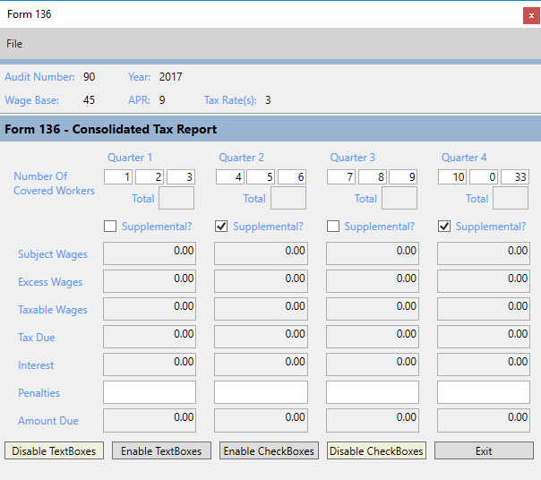

# Code for finding all children in a container

Sample to disable enable TextBoxes in a StackPanel and set default width of TextBoxes for specificly tagged TextBoxes, in this case the 12 under "Number of Covered workers"..

[Source code](https://social.technet.microsoft.com/wiki/contents/articles/53438.wpf-get-all-controls-of-a-specific-type-c.aspx)

## See also 

[WPF: get all controls of a specific type using C#](https://social.technet.microsoft.com/wiki/contents/articles/53438.wpf-get-all-controls-of-a-specific-type-using-c.aspx)

In this article language extension methods are presented to locate controls in containers such as a windows Jump , grid Jump or StackPanel Jump for performing business logic like obtaining a selection from a group of Checkboxes, a selected RadioButton in a group or enabling/disabling specific types of controls.

## WPF/C# Setting visibility of controls based off another control
[Article location](https://social.technet.microsoft.com/wiki/contents/articles/53480.wpfc-setting-visibility-of-controls-based-off-another-control.aspx)

